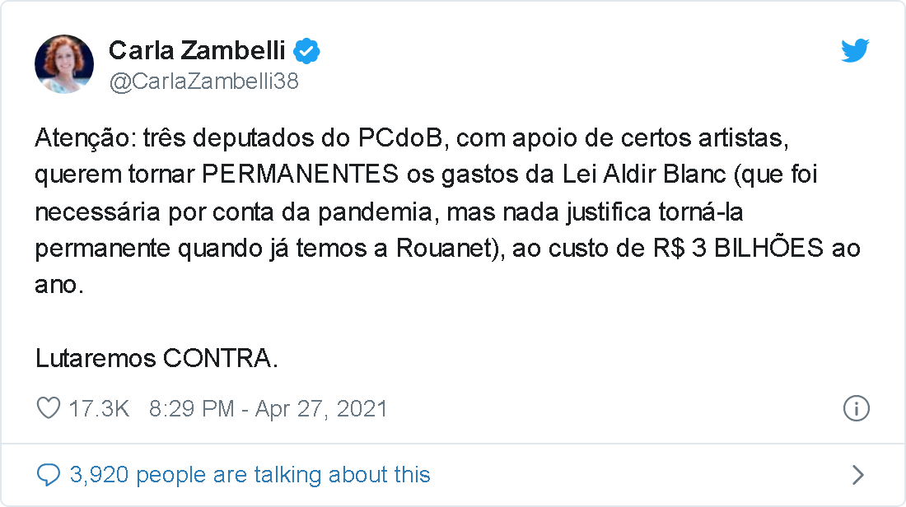
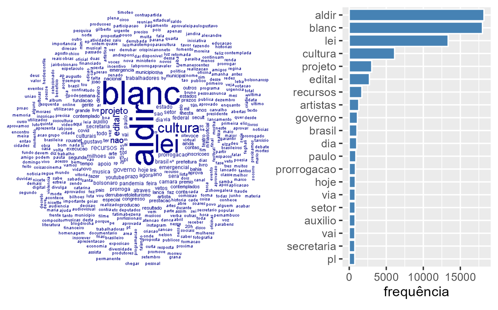

```{r setup, include=FALSE}
options(htmltools.dir.version = FALSE)
```

```{r xaringan-themer, include=FALSE}
library(xaringanthemer)
style_duo_accent(
  # primary_color = "#345865",
  primary_color = "#B56B6F",
  secondary_color = "#2c8475",
  black_color = "#4242424",
  white_color = "#FFF",
  base_font_size = "25px",
  # text_font_family = "Jost",
  # text_font_url = "https://indestructibletype.com/fonts/Jost.css",
  header_font_google = google_font("Roboto Slab", "400", "700"),
  header_font_weight = "400",
  inverse_header_color = "#eaeaea",
  title_slide_text_color = "#FFFFFF",
  text_slide_number_color = "#9a9a9a",
  text_bold_color = "#f79334",
  code_inline_color = "#B56B6F",
  code_highlight_color = "transparent",
  link_color = "#2c8475",
  table_row_even_background_color = lighten_color("#345865", 0.9),
  extra_fonts = list(
    "https://indestructibletype.com/fonts/Jost.css",
    google_font("Amatic SC", "400")
  ),
  colors = c(
    green = "#31b09e",
    "green-dark" = "#2c8475",
    highlight = "#87f9bb",
    purple = "#887ba3",
    pink = "#B56B6F",
    orange = "#f79334",
    red = "#dc322f",
    `blue-dark` = "#002b36",
    `text-dark` = "#202020",
    `text-darkish` = "#424242",
    `text-mild` = "#606060",
    `text-light` = "#9a9a9a",
    `text-lightest` = "#eaeaea"
  ),
  extra_css = list(
    ".remark-slide-content h3" = list(
      "margin-bottom" = 0, 
      "margin-top" = 0
    ),
    ".smallish, .smallish .remark-code-line" = list(`font-size` = "0.9em")
  )
)
#library(xaringanExtra)
#xaringanExtra::use_xaringan_extra(c("animate_css")
#xaringanExtra::use_extra_styles()
```

```{r metadata, echo=FALSE,warning=FALSE,message=FALSE}
library(metathis)
meta() %>% 
  meta_description("A Lei Aldir Blanc nas Mídias") %>% 
  meta_social(
    title = "A Lei Aldir Blanc nas Mídias",
    url = "https://steven.metodosquantitativos.com/",
    twitter_card_type = "summary_large_image",
    twitter_creator = "anapardoteatral"
  )
```

```{r components, include=FALSE}
slides_from_images <- function(
  path,
  regexp = NULL,
  class = "hide-count",
  background_size = "contain",
  background_position = "top left"
) {
  if (isTRUE(getOption("slide_image_placeholder", FALSE))) {
    return(glue::glue("Slides to be generated from [{path}]({path})"))
  }
  if (fs::is_dir(path)) {
    imgs <- fs::dir_ls(path, regexp = regexp, type = "file", recurse = FALSE)
  } else if (all(fs::is_file(path) && fs::file_exists(path))) {
    imgs <- path
  } else {
    stop("path must be a directory or a vector of images")
  }
  imgs <- fs::path_rel(imgs, ".")
  breaks <- rep("\n---\n", length(imgs))
  breaks[length(breaks)] <- ""

  txt <- glue::glue("
  class: {class}
  background-image: url('{imgs}')
  background-size: {background_size}
  background-position: {background_position}
  {breaks}
  ")

  paste(txt, sep = "", collapse = "")
}
options("slide_image_placeholder" = FALSE)
```


class: left title-slide
background-image: url('fundo_aldir_blanc3.png')
background-size: cover
background-position: top center

# A Lei Aldir Blanc  <br>  nas Mídias 


.title-where[
Emergências e imersões: <br>  Lei Aldir Blanc e as políticas cullturais no Rio de Janeiro
<br> 
Ana Lúcia Pardo & Steven Dutt-Ross
]

```{css echo=FALSE}
@keyframes title-text{
  0% {
      opacity: 0;
      text-shadow: -20px 30px 5px rgba(0,0,0,0.25);
      transform: translate(15px, -15px);
  }
  10% {
      opacity: 0;
      text-shadow: -20px 30px 5px rgba(0,0,0,0.25);
      transform: translate(15px, -15px);
  }
  80% {
      opacity: 1;
      text-shadow: -5px 5px 10px rgba(0,0,0,0.25);
      transform: translate(0, 0);
  }
  100% {
      opacity: 1;
      text-shadow: -5px 5px 10px rgba(0,0,0,0.25);
      transform: translate(0, 0);
  }
}

@keyframes enter-right {
  0% {
    opacity: 0;
    transform: rotate(90deg) translateY(-50px)
  }
  20% {
    opacity: 0;
    transform: rotate(90deg) translateY(-50px)
  }
  80% {
    opacity: 1;
    transform: rotate(90deg) translateY(0)
  }
  100% {
    opacity: 1;
    transform: rotate(90deg) translateY(0)
  }
}

@keyframes enter-left {
  0% {
    opacity: 0;
    transform: translateY(100px)
  }
  20% {
    opacity: 0;
    transform: translateY(100px)
  }
  60% {
    opacity: 1;
    transform: translateX(0)
  }
  100% {
    opacity: 1;
    transform: translateX(0)
  }
}

.remark-visible .title-slide h1,
.remark-visible .title-slide .side-text,
.remark-visible .title-slide .title-where {
  animation-duration: 13s;
}

.title-slide h1 {
  font-size: 100px;
  font-family: Jost, sans;
  animation-name: title-text;
  animation-direction: alternate;
  animation-iteration-count: infinite;
}

.side-text {
  color: white;
  opacity: 0.66;
  transform: rotate(90deg);
  position: absolute;
  font-size: 20px;
  top: 130px;
  right: -130px;
  transition: opacity 0.5s ease-in-out;
  animation-name: enter-right;
  animation-direction: alternate;
  animation-iteration-count: infinite;
}

.side-text:hover {
  opacity: 1;
}

.side-text a {
  color: white;
}

.title-where {
  color: white;
  font-family: 'Amatic SC', sans;
  font-size: 40px;
  position: absolute;
  bottom: 10px;
  animation-name: enter-left;
  animation-direction: alternate;
  animation-iteration-count: infinite;
  animation-timing-function: ease-in-out;
}
```

---
class: center, middle

## A Lei de Emergência Cultural (Lei Federal nº 14.017/2020), batizada de Lei Aldir Blanc ou LAB.

## A ampla mobilização envolvendo o setor cultural.

## Cultura ocupou a centralidade do Parlamento.


```{r, echo=FALSE,eval=FALSE, warning=FALSE,message=FALSE}
gitlink::ribbon_css("https://apoenaredecultural.wordpress.com/", 
    text = "Projeto Apoena",width = "250px", top = "28px", 
    parent_css = list(top = "00px", "z-index" = "100"))

```


<div class="ribbon-parent" style="position:absolute;top:0px;overflow:hidden;width:150px;height:150px;z-index:5;pointer-events:none;right:0px;top:00px;z-index:100;">
<div class="ribbon" style="background-color:white;overflow:hidden;white-space:nowrap;position:absolute;top:45px;box-shadow:0 0 10px #888;pointer-events:auto;right:-50px;transform:rotate(45deg);width:250px;top:28px;"><a href="https://apoenaredecultural.wordpress.com/" style="border:1px solid white;color:black;display:block;font:bold 95% &#39;Collegiate&#39;, Arial, sans-serif;margin:1px 0;padding:6px 50px;text-align:center;text-decoration:none;letter-spacing:-0.3px;" target="_blank"> Apoena</a></div></div>
<style>
  .ribbon:hover {opacity:1;}
  .ribbon {opacity:0.6;transition:opacity 0s ease 0s;}
</style>


---

# Google News

> Google News é um agregador de notícias e aplicativo desenvolvido pela Google.   
  
> Ele apresenta um fluxo contínuo e personalizável de artigos organizados a partir de milhares de editores e revistas. 


---

# Método


## Coleta de dados via Google News

### Coleta de dados matérias do Google News com a expressão Lei Aldir Blanc durante 82 semanas
### Período: entre 25/02/2021 e 15/11/2022
### Ferramentas Python & R

---

# Limpeza dos dados

### 55.062 links do google news sobre a Lei Aldir Blanc,  
### 4.353 links tinham títulos,  
### Retiradas as matérias internacionais,   
### Retiradas as matérias repetidas (o jornal republica a mesma matéria)

---

# Limpeza dos dados

### Em função disso, obtivemos, após a limpeza, um banco de dados com 2.626 matérias únicas. 
<br>

### O mesmo procedimento foi realizado com o termo de busca “Lei Paulo Gustavo”.

---

### Método - Análise quantitativa de textos
####  Nível Macro
Frequência da Origem de cada artigo;
> Congresso em Foco, Catraca Livre, DeOlhoNailha, Outracoisa, Folha de Pernambuco

Frequência do Eixo (esquerda/direita) de cada artigo 
> CartaCapital,PT,PCdoB, Brasil 247,Mídia Ninja, Brasil de Fato, Le Monde Diplomatique Brasil, -> ESQUERDA   
> O Antagonista, Valor Econômico, Jovem Pan, R7, ISTOÉ, Istoé Dinheiro, CNN Brasil, Estadão, VEJA, Veja Rio, -> DIREITA


---

# Método

## Análise quantitativa de textos
#### Nível Micro
1. Frequência de cada palavra
2. Frequência de cada palavra por origem
3. Frequência de cada palavra por eixo

---

# Análise de sentimento 
A análise de sentimentos é o uso de processamento de linguagem natural, análise de texto para identificar, extrair, quantificar e estudar sistematicamente estados afetivos e informações subjetivas (Positivo/Negativo). 

---

# Modelagem de tópicos

O Que é modelagem de tópicos?

Modelagem de Tópicos é uma forma de identificar padrões em um corpus. A abordagem gera grupos de palavras a respeito do corpus distribuídas em “tópicos”. Miriam Posner descreve a modelagem de tópicos como “um método para achar clusters de palavras (chamado “tópicos” de forma abreviada) em grandes corpos de texto. ” (GRUPOS DE PALAVRAS)


---


# Resultados encontrados


---
class: center

### Tabela 1 – Emojis mais utilizados

```{r, echo=FALSE, message=FALSE, warning=FALSE, fig.align='center'}
#knitr::include_graphics("img/mosaico.png")


load("C:/Users/Hp/Documents/GitHub/DADOS_APOENA/twitter/dados/top_10_emojis.RData")

library(dplyr)
library(gt)
top_10_emojis %>% select(unicode,n) %>% gt() %>% 
  tab_options(table_body.hlines.color = "lightgrey") %>%
  cols_label(
    unicode = "Emoji",
    n = "Quantidade"
  )  %>%
  tab_style(
    style = cell_text(weight = "bold"),
    locations = cells_column_spanners(spanners = everything())
  ) 

```

---
class: center

### Tabela 2 – Hashtags mais utilizadas

```{r, echo=FALSE, message=FALSE, warning=FALSE, fig.align='center'}
load("C:/Users/Hp/Documents/GitHub/DADOS_APOENA/twitter/dados/top_hashtags.RData")
top_hashtags <-top_hashtags %>% filter(hashtag!='#lei')
top_hashtags <-top_hashtags[1:10,]

top_hashtags %>% gt() %>% 
  tab_options(table_body.hlines.color = "lightgrey") %>%
  cols_label(
    hashtag = "Hashtag",
    n = "Quantidade"
  )  %>%
  tab_style(
    style = cell_text(weight = "bold"),
    locations = cells_column_spanners(spanners = everything())
  ) 

```

---
class: center

### Tabela 3 – Os tweets favoritos 

```{r, echo=FALSE, message=FALSE, warning=FALSE, fig.align='center'}

load("C:/Users/Hp/Documents/GitHub/DADOS_APOENA/twitter/dados/most_liked_tweet.RData")

most_liked_tweet <-most_liked_tweet %>% select(screen_name,text,favorite_count)
most_liked_tweet <-most_liked_tweet[1:10,]

most_liked_tweet %>% gt() %>% 
  tab_options(table_body.hlines.color = "lightgrey") %>%
  cols_label(
    screen_name = "Nome",
    text = "Texto",
    favorite_count = "Favorito"
  )  %>%
  tab_style(
    style = cell_text(weight = "bold"),
    locations = cells_column_spanners(spanners = everything())
  ) 


```


---
class: center


```{r, echo=FALSE, message=FALSE, warning=FALSE, fig.align='center'}



```


---
class: center


```{r, echo=FALSE, message=FALSE, warning=FALSE, fig.align='center'}


```


---
class: center


```{r, echo=FALSE, message=FALSE, warning=FALSE, fig.align='center'}


```


---
class: center


```{r, echo=FALSE, message=FALSE, warning=FALSE, fig.align='center'}


```


---
class: center


```{r, echo=FALSE, message=FALSE, warning=FALSE, fig.align='center'}
knitr::include_graphics("img/mfriasoficial_4.png")


```


---
class: center

### Tabela 4 – O mesmo acontece com os retweets

```{r, echo=FALSE, message=FALSE, warning=FALSE, fig.align='center'}

load("C:/Users/Hp/Documents/GitHub/DADOS_APOENA/twitter/dados/most_retweeted_tweet.RData")
most_retweeted_tweet <-most_retweeted_tweet %>% select(screen_name,text,retweet_count)
most_retweeted_tweet <-most_retweeted_tweet[1:10,]

most_retweeted_tweet %>% gt() %>% 
  tab_options(table_body.hlines.color = "lightgrey") %>%
  cols_label(
    screen_name = "Nome",
    text = "Texto",
    retweet_count = "Retweets"
  )  %>%
  tab_style(
    style = cell_text(weight = "bold"),
    locations = cells_column_spanners(spanners = everything())
  ) 

```


---

# Discussão

### 1. Apesar de ser uma lei do setor cultural, a quantidade de favoritos e retweets está relacionada a políticos e não aos artistas (apropriação por parte dos politicos da visibilidade da LAB)
<br>
### 2. Encontramos evidências de atores políticos relacionando a LAB a uma Guerra Cultural

---


```{r, echo=FALSE, message=FALSE, warning=FALSE, fig.align='center'}



```


---

## Conclusão

* Análise das postagens compartilhadas em **17.965 tweets**, no período de 22/03/2021 a 22/02/2022 em torno da LAB.

* Identificamos o **engajamento de artistas** e demais trabalhadores do setor cultural que se juntaram numa intensa mobilização para aprovar, sancionar e executar a LAB durante a pandemia (constatado nas hashtags #DerrubaVetoLeiAldirBlanc, #LabProrrogaPraValer e #MaisTempoParaCultura). 

* A direita concentra a sua fala sobre veto à Lei, enquanto a esquerda fala da origem de criação, em seus processos de autoria, relatoria e aprovação da LAB. 

---

## Conclusão

* Mesmo **NÃO sendo os criadores, autores e sequer relatores da LAB**, Mário Frias e Carla Zambelli, conforme vimos, reúnem a maior quantidade de tweets postados nas redes sociais (guerra cultural e censura do projeto Roda Bixa).


* Devemos observar o papel estratégico da comunicação e da cultura, tendo a linguagem, a palavra, como elemento de intersecção, nesse caso, nas disputas de narrativas, com o uso da plataforma do Twitter como instrumento de **busca da hegemonia** de uma determinada ideologia e de controle da opinião pública nacional. 

* A comunicação esta sendo utilizada, com uma boa dosagem de desinformação, para **promover a guerra cultural**, de cunho ideológico, usada para desqualificar o inimigo, nesse caso, a esquerda.


[1] http://miriamposner.com/blog/?p=1335
