```{r setup, include=FALSE}
options(htmltools.dir.version = FALSE)
```

```{r xaringan-themer, include=FALSE}
library(xaringanthemer)
style_duo_accent(
  # primary_color = "#345865",
  primary_color = "#d18513",
  secondary_color = "#2c8475",
  black_color = "#4242424",
  white_color = "#FFF",
  base_font_size = "25px",
  # text_font_family = "Jost",
  # text_font_url = "https://indestructibletype.com/fonts/Jost.css",
  header_font_google = google_font("Roboto Slab", "400", "700"),
  header_font_weight = "400",
  inverse_header_color = "#eaeaea",
  title_slide_text_color = "#FFFFFF",
  text_slide_number_color = "#9a9a9a",
  text_bold_color = "#f79334",
  code_inline_color = "#B56B6F",
  code_highlight_color = "transparent",
  link_color = "#2c8475",
  table_row_even_background_color = lighten_color("#345865", 0.9),
  extra_fonts = list(
    "https://indestructibletype.com/fonts/Jost.css",
    google_font("Amatic SC", "400")
  ),
  colors = c(
    green = "#31b09e",
    "green-dark" = "#2c8475",
    highlight = "#87f9bb",
    purple = "#887ba3",
    pink = "#B56B6F",
    orange = "#f79334",
    red = "#dc322f",
    `blue-dark` = "#002b36",
    `text-dark` = "#202020",
    `text-darkish` = "#424242",
    `text-mild` = "#606060",
    `text-light` = "#9a9a9a",
    `text-lightest` = "#eaeaea"
  ),
  extra_css = list(
    ".remark-slide-content h3" = list(
      "margin-bottom" = 0, 
      "margin-top" = 0
    ),
    ".smallish, .smallish .remark-code-line" = list(`font-size` = "0.9em")
  )
)
#library(xaringanExtra)
#xaringanExtra::use_xaringan_extra(c("animate_css")
#xaringanExtra::use_extra_styles()
```

```{r metadata, echo=FALSE,warning=FALSE,message=FALSE}
library(metathis)
meta() %>% 
  meta_description("A Lei Aldir Blanc nas Mídias") %>% 
  meta_social(
    title = "A Lei Aldir Blanc nas Mídias",
    url = "https://steven.metodosquantitativos.com/",
    twitter_card_type = "summary_large_image",
    twitter_creator = "anapardoteatral"
  )
```

```{r components, include=FALSE}
slides_from_images <- function(
  path,
  regexp = NULL,
  class = "hide-count",
  background_size = "contain",
  background_position = "top left"
) {
  if (isTRUE(getOption("slide_image_placeholder", FALSE))) {
    return(glue::glue("Slides to be generated from [{path}]({path})"))
  }
  if (fs::is_dir(path)) {
    imgs <- fs::dir_ls(path, regexp = regexp, type = "file", recurse = FALSE)
  } else if (all(fs::is_file(path) && fs::file_exists(path))) {
    imgs <- path
  } else {
    stop("path must be a directory or a vector of images")
  }
  imgs <- fs::path_rel(imgs, ".")
  breaks <- rep("\n---\n", length(imgs))
  breaks[length(breaks)] <- ""

  txt <- glue::glue("
  class: {class}
  background-image: url('{imgs}')
  background-size: {background_size}
  background-position: {background_position}
  {breaks}
  ")

  paste(txt, sep = "", collapse = "")
}
options("slide_image_placeholder" = FALSE)
```


class: left title-slide
background-image: url('fundo_aldir_blanc3.png')
background-size: cover
background-position: top center

# A Lei Aldir Blanc  <br>  nas Mídias 


.title-where[
Emergências e imersões: <br>  Lei Aldir Blanc e as políticas cullturais no Rio de Janeiro
<br> 
Ana Lúcia Pardo & Steven Dutt-Ross
]

```{css echo=FALSE}
@keyframes title-text{
  0% {
      opacity: 0;
      text-shadow: -20px 30px 5px rgba(0,0,0,0.25);
      transform: translate(15px, -15px);
  }
  10% {
      opacity: 0;
      text-shadow: -20px 30px 5px rgba(0,0,0,0.25);
      transform: translate(15px, -15px);
  }
  80% {
      opacity: 1;
      text-shadow: -5px 5px 10px rgba(0,0,0,0.25);
      transform: translate(0, 0);
  }
  100% {
      opacity: 1;
      text-shadow: -5px 5px 10px rgba(0,0,0,0.25);
      transform: translate(0, 0);
  }
}

@keyframes enter-right {
  0% {
    opacity: 0;
    transform: rotate(90deg) translateY(-50px)
  }
  20% {
    opacity: 0;
    transform: rotate(90deg) translateY(-50px)
  }
  80% {
    opacity: 1;
    transform: rotate(90deg) translateY(0)
  }
  100% {
    opacity: 1;
    transform: rotate(90deg) translateY(0)
  }
}

@keyframes enter-left {
  0% {
    opacity: 0;
    transform: translateY(100px)
  }
  20% {
    opacity: 0;
    transform: translateY(100px)
  }
  60% {
    opacity: 1;
    transform: translateX(0)
  }
  100% {
    opacity: 1;
    transform: translateX(0)
  }
}

.remark-visible .title-slide h1,
.remark-visible .title-slide .side-text,
.remark-visible .title-slide .title-where {
  animation-duration: 13s;
}

.title-slide h1 {
  font-size: 100px;
  font-family: Jost, sans;
  animation-name: title-text;
  animation-direction: alternate;
  animation-iteration-count: infinite;
}

.side-text {
  color: white;
  opacity: 0.66;
  transform: rotate(90deg);
  position: absolute;
  font-size: 20px;
  top: 130px;
  right: -130px;
  transition: opacity 0.5s ease-in-out;
  animation-name: enter-right;
  animation-direction: alternate;
  animation-iteration-count: infinite;
}

.side-text:hover {
  opacity: 1;
}

.side-text a {
  color: white;
}

.title-where {
  color: white;
  font-family: 'Amatic SC', sans;
  font-size: 40px;
  position: absolute;
  bottom: 10px;
  animation-name: enter-left;
  animation-direction: alternate;
  animation-iteration-count: infinite;
  animation-timing-function: ease-in-out;
}
```

---
class: center, middle

## A Lei de Emergência Cultural (Lei Federal nº 14.017/2020), batizada de Lei Aldir Blanc ou LAB.

## A ampla mobilização envolvendo o setor cultural.

## Cultura ocupou a centralidade do Parlamento.


```{r, echo=FALSE,eval=FALSE, warning=FALSE,message=FALSE}
gitlink::ribbon_css("https://apoenaredecultural.wordpress.com/", 
    text = "Projeto Apoena",width = "250px", top = "28px", 
    parent_css = list(top = "00px", "z-index" = "100"))

```


<div class="ribbon-parent" style="position:absolute;top:0px;overflow:hidden;width:150px;height:150px;z-index:5;pointer-events:none;right:0px;top:00px;z-index:100;">
<div class="ribbon" style="background-color:white;overflow:hidden;white-space:nowrap;position:absolute;top:45px;box-shadow:0 0 10px #888;pointer-events:auto;right:-50px;transform:rotate(45deg);width:250px;top:28px;"><a href="https://apoenaredecultural.wordpress.com/" style="border:1px solid white;color:black;display:block;font:bold 95% &#39;Collegiate&#39;, Arial, sans-serif;margin:1px 0;padding:6px 50px;text-align:center;text-decoration:none;letter-spacing:-0.3px;" target="_blank"> Apoena</a></div></div>
<style>
  .ribbon:hover {opacity:1;}
  .ribbon {opacity:0.6;transition:opacity 0s ease 0s;}
</style>


---

# Google News

> Google News é um agregador de notícias e aplicativo desenvolvido pela Google.   
  
> Ele apresenta um fluxo contínuo e personalizável de artigos organizados a partir de milhares de editores e revistas. 

---

# Giro linguístico

O impacto das linguagens estruturadas em matérias no google news
1. Os discursos nas mídias são práticas sociais.
2. Dar uma atenção maior ao papel desempenhado pelas linguagens nas mídias.
3. Desenvolver uma maneira de relatar uma percepção da LAB na linguagem das mídias


---

# Giro linguístico

Mais do que meramente descritiva, a linguagem nas notícias se institui como uma ação sobre o mundo.   

A linguagem nas notícias é constitutiva da realidade?   
A linguagem nas notícias é um instrumento para atuar sobre o mundo?   

Entender o contexto social da LAB, mas como também de se escreve, fala, e constitui a narrativa.    
Todos discursos construidos nas mídias têm um contexto de produção.   

---

# Método

## Coleta de dados via Google News

### Coleta de dados matérias do Google News com a expressão Lei Aldir Blanc durante 82 semanas
### Período: entre 25/02/2021 e 15/11/2022
### Ferramentas Python & R

---

# Limpeza dos dados

### 55.062 links do google news sobre a Lei Aldir Blanc,  
### 4.353 links tinham títulos,  
### Retiradas as matérias internacionais,   
### Retiradas as matérias repetidas (o jornal republica a mesma matéria)

---

# Limpeza dos dados

### Em função disso, obtivemos, após a limpeza, um banco de dados com 2.626 matérias únicas. 
<br>

### O mesmo procedimento foi realizado com o termo de busca “Lei Paulo Gustavo”.

---

### Método - Análise quantitativa de textos
####  Nível Macro
Frequência da Origem de cada artigo;
> Congresso em Foco, Catraca Livre, DeOlhoNailha, Outracoisa, Folha de Pernambuco

Frequência do Eixo (esquerda/direita) de cada artigo 
> CartaCapital,PT,PCdoB, Brasil 247,Mídia Ninja, Brasil de Fato, Le Monde Diplomatique Brasil, -> ESQUERDA   
> O Antagonista, Valor Econômico, Jovem Pan, R7, ISTOÉ, Istoé Dinheiro, CNN Brasil, Estadão, VEJA, Veja Rio, -> DIREITA


---

# Método

## Análise quantitativa de textos
#### Nível Micro
1. Frequência de cada palavra
2. Frequência de cada palavra por origem
3. Frequência de cada palavra por eixo

---

# Resultados encontrados


---
class: center

### Tabela 1 – Matérias sobre a LAB

```{r, echo=FALSE, message=FALSE, warning=FALSE, fig.align='center'}
library(dplyr)
library(gt)
dados = readRDS(file=paste0(getwd(),'/dados/dados_google_new_LAB_UNIRIO_3_11_2022.Rds'))
dados = dados %>% distinct(title, .keep_all = TRUE)

set.seed(12345)
dados %>% sample_n(20) %>% select(title,site) %>% gt() %>% 
  tab_options(table_body.hlines.color = "lightgrey") %>%
  cols_label(
    title = "Titulo",
    site = "fonte"
  )  %>%
  tab_style(
    style = cell_text(weight = "bold"),
    locations = cells_column_spanners(spanners = everything())
  ) 

```


---
class: center


```{r, echo=FALSE, message=FALSE, warning=FALSE, fig.align='center'}
knitr::include_graphics("img/neutra.png")

```


---
class: center


```{r, echo=FALSE, message=FALSE, warning=FALSE, fig.align='center'}
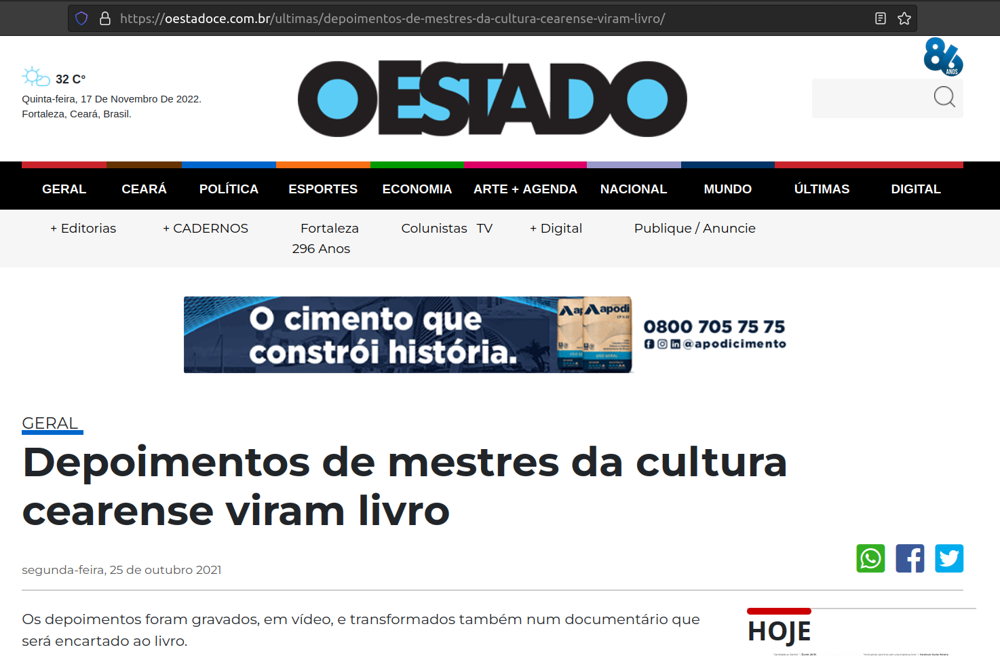

```


---
class: center


```{r, echo=FALSE, message=FALSE, warning=FALSE, fig.align='center'}


```


---
class: center


```{r, echo=FALSE, message=FALSE, warning=FALSE, fig.align='center'}
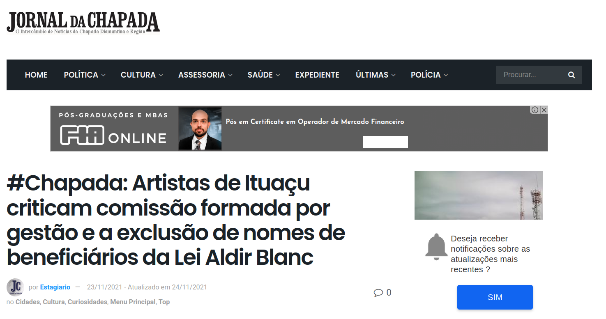

```


---
class: center


```{r, echo=FALSE, message=FALSE, warning=FALSE, fig.align='center'}

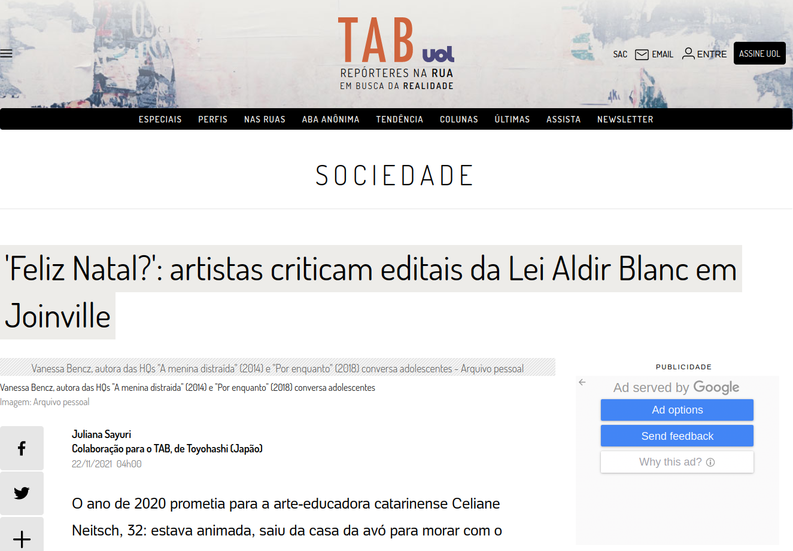

```


---
class: center

### Tabela 2 – Matérias sobre a LAB

```{r, echo=FALSE, message=FALSE, warning=FALSE, fig.align='center'}
library(dplyr)
library(gt)
dados2 = readRDS(file=paste0(getwd(),'/dados/dados_para_tabela.Rds'))

set.seed(12345)
dados2 %>% filter(origem!='outro') %>% select(origem) %>% 
  table()%>% data.frame() %>% gt() %>% 
  tab_options(table_body.hlines.color = "lightgrey") %>%
  cols_label(
    origem = "Grupo",
    Freq = "Quantidade"
  )  %>%
  tab_style(
    style = cell_text(weight = "bold"),
    locations = cells_column_spanners(spanners = everything())
  ) 

```


---
class: center


```{r, echo=FALSE, message=FALSE, warning=FALSE, fig.align='center'}

knitr::include_graphics("img/nevem_e_freq.png")

```


---

# Análise de frequência relativa

Pontuação para identificar palavras frequentes em documentos em um grupo de destino e de referência.

Frequência de palavras que estão mais em um grupo do que em outros veículos

---
class: center

### Palavras mais usada pelo Senado 

```{r, echo=FALSE, message=FALSE, warning=FALSE, fig.align='center'}
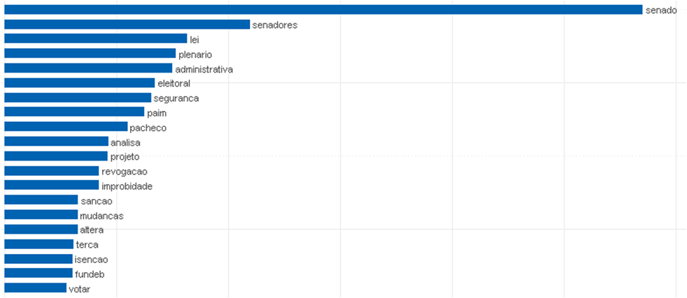
```


---
class: center

### Palavras mais usada pelos Deputados 


```{r, echo=FALSE, message=FALSE, warning=FALSE, fig.align='center'}
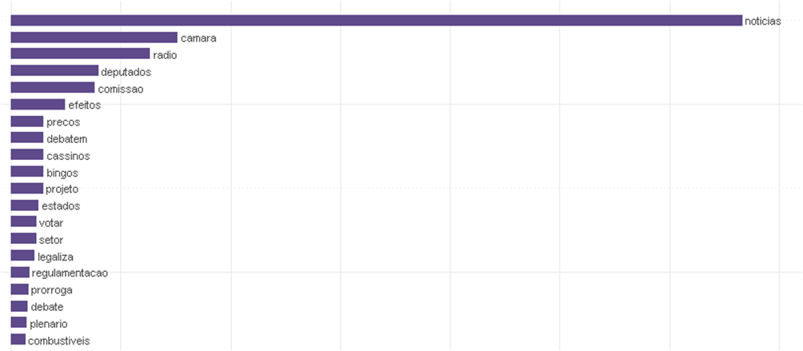
```

---
class: center

### Palavras mais usada pelas Prefeituras


```{r, echo=FALSE, message=FALSE, warning=FALSE, fig.align='center'}
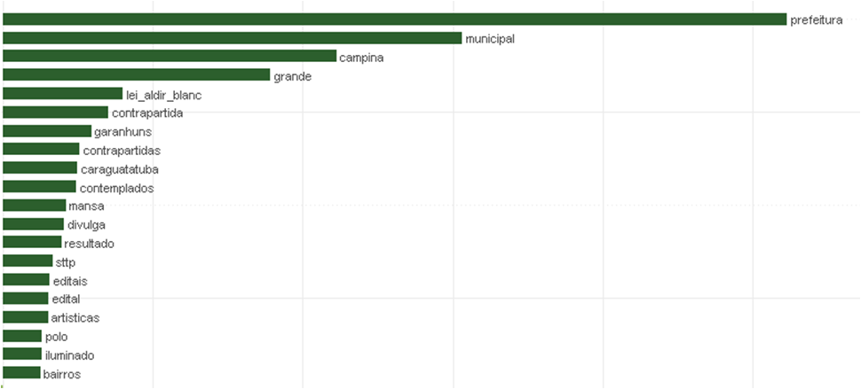
```

---
class: center

### Palavras mais usada pelos Governos Estaduais


```{r, echo=FALSE, message=FALSE, warning=FALSE, fig.align='center'}
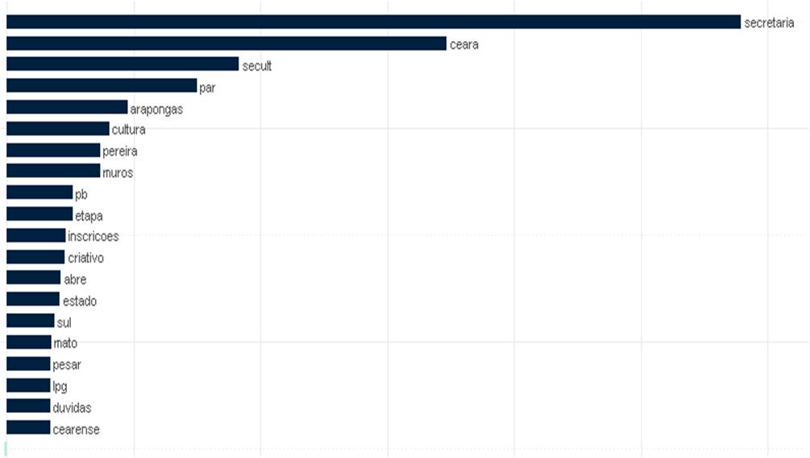
```

---
class: center

### Palavras mais usada pela EBC


```{r, echo=FALSE, message=FALSE, warning=FALSE, fig.align='center'}
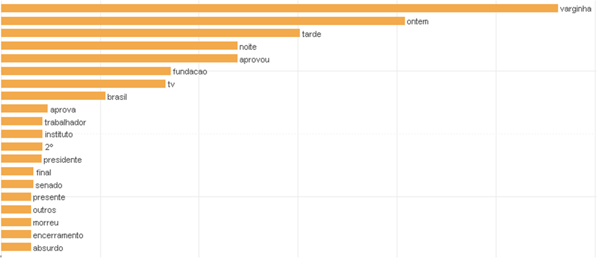
```

---
class: center

### Palavras mais usada pelos Blogs/Mídias Alternativas


```{r, echo=FALSE, message=FALSE, warning=FALSE, fig.align='center'}
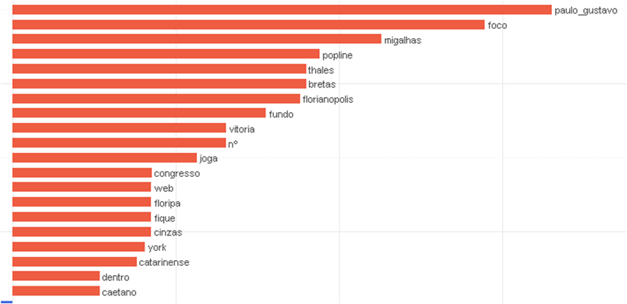
```
---
class: center

### Palavras mais usada pela Mídias Tradicional


```{r, echo=FALSE, message=FALSE, warning=FALSE, fig.align='center'}
knitr::include_graphics("img/Midia_Tradicional_zoom.png")
```

---

# Análise de sentimento  
A análise de sentimentos é o uso de processamento de linguagem natural para identificar, extrair, quantificar e estudar sistematicamente estados afetivos e informações subjetivas (Positivo/Negativo). 


```{r, echo=FALSE, message=FALSE, warning=FALSE, fig.align='center'}
library(lexiconPT)
selecao = c('abelhudo','reeleito','aborrecer-se','afectuoso','afirmativo')

sent = lexiconPT::sentiLex_lem_PT02
tabela_sent = sent %>% filter(term%in%selecao)  %>% select(term,grammar_category,polarity)%>% gt() %>% 
  tab_options(table_body.hlines.color = "lightgrey") %>%
  cols_label(
    term = "termo",
    grammar_category = "categoria",
    polarity="polaridade"
  )  %>%
  tab_style(
    style = cell_text(weight = "bold"),
    locations = cells_column_spanners(spanners = everything())
  ) 
tabela_sent
```


---
class: center

```{r, echo=FALSE, message=FALSE, warning=FALSE, fig.align='center',out.width=800,out.height=600}
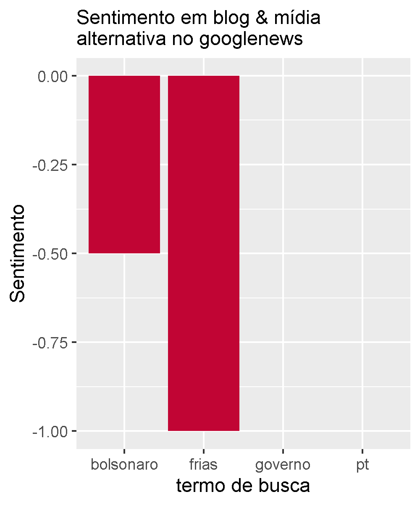
```

---
class: center

```{r, echo=FALSE, message=FALSE, warning=FALSE, fig.align='center',out.width=800,out.height=600}
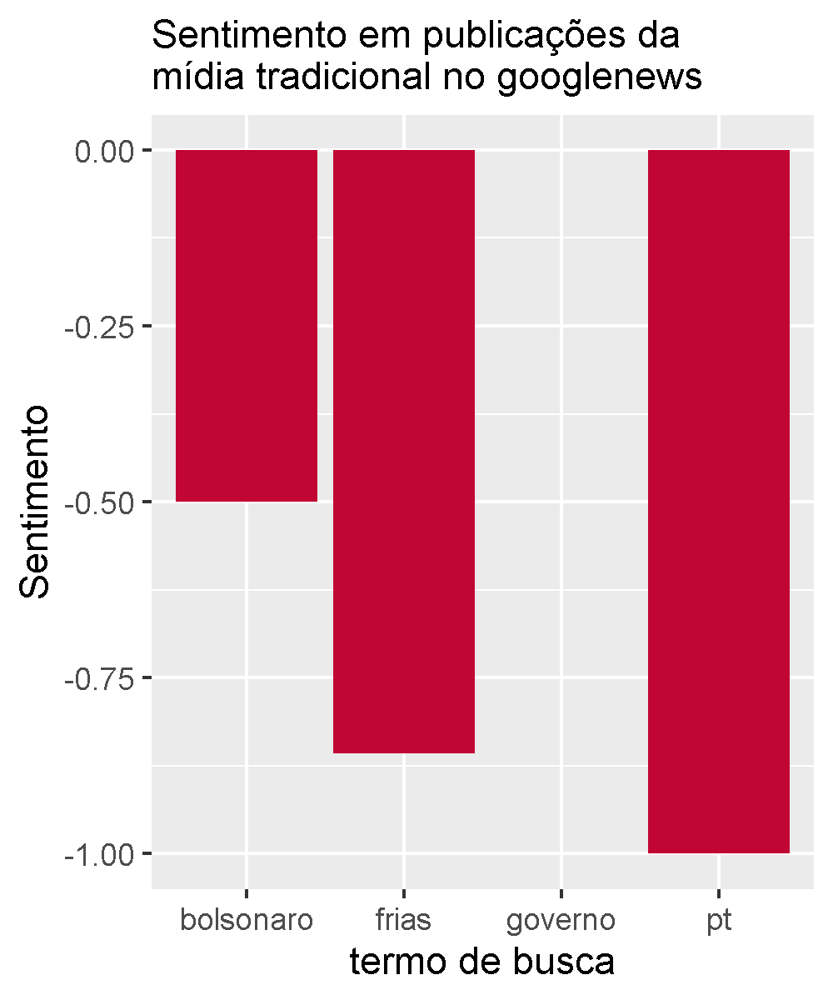
```


---

# Modelagem de tópicos

### O que é modelagem de tópicos?

Modelagem de Tópicos é uma forma de identificar padrões em um *corpus*. A abordagem gera grupos de palavras a respeito do corpus distribuídas em “tópicos”. Miriam Posner descreve a modelagem de tópicos como “um método para achar clusters de palavras (chamado “tópicos”) em *corpus*.” (GRUPOS DE PALAVRAS)


---
class: center

```{r, echo=FALSE, message=FALSE, warning=FALSE, fig.align='center',out.width=800,out.height=600}
library(readxl)
topic <- read_excel("img/topic_model_metodo2.xlsx")
topic %>% gt() %>% 
  tab_options(table_body.hlines.color = "lightgrey") %>%
  tab_style(
    style = cell_text(weight = "bold"),
    locations = cells_column_spanners(spanners = everything())
  ) 
```


---
class: center

```{r, echo=FALSE, message=FALSE, warning=FALSE, fig.align='center',out.width=800,out.height=600}
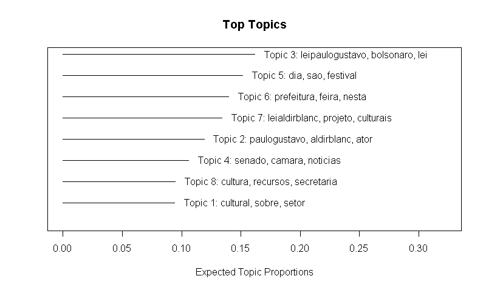
```


---
class: center

# CONCLUSÃO

---
class: center

```{r, echo=FALSE, message=FALSE, warning=FALSE, fig.align='center',out.width=1000,out.height=600}

```

---
class: center

```{r, echo=FALSE, message=FALSE, warning=FALSE, fig.align='center',out.width=900,out.height=600}

```

---

# Referências
[1] http://miriamposner.com/blog/?p=1335     
[2] Gonzaga S (2017). _lexiconPT: Lexicons for Portuguese Text Analysis_. R package version 0.1.0,
  <https://CRAN.R-project.org/package=lexiconPT>
